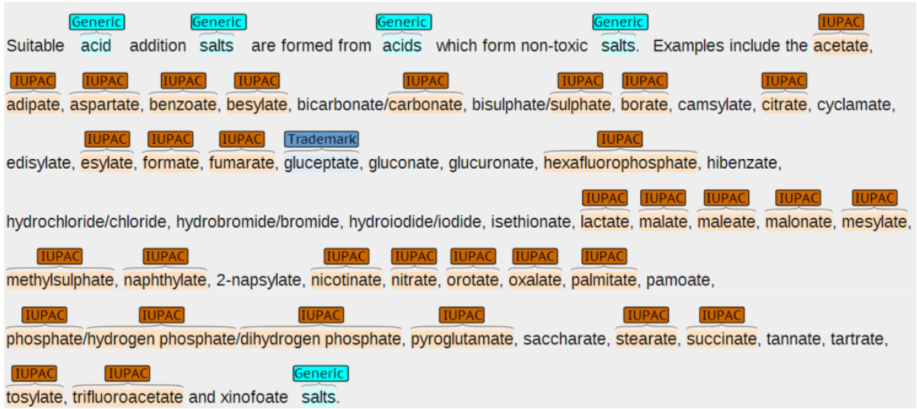
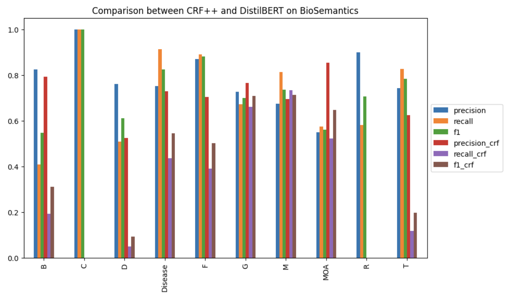
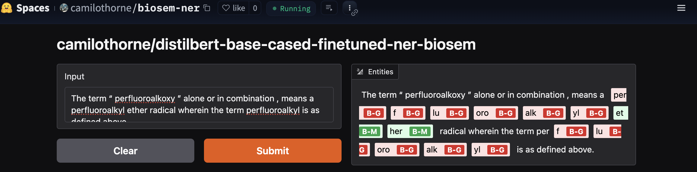

# NER Models for the BioSemantics Corpus

[Named entity recognition](https://en.wikipedia.org/wiki/Named-entity_recognition) (NER) is an NLP task of great practical importance. While ubiquitous, it can still be probelmatic in very specialized domains like the pharmacological domain. While in 2025 there is a belief that NER can be solved by large language models (LLMs), be it self-hosted or through commercial APIs, it turns out that it also become extremely easy to fine-tune cheap pre-trained BERT/encoder-only SOTA models. In this demo, I train and deploy a biomedical SOTA NER model with a few lines of code, using HuggingFace. 

## BioSemantics corpus

For this demo, I rely on the [BioSemantics](https://web.archive.org/web/20171028233353/http://biosemantics.org/index.php/resources/chemical-patent-corpus) corpus. It is a corpus of pharmacological entities built from English-only patents (USPTO, WO and EU offices):

<div align="center">



</div>

<br>

For the current demo, I used only its USPTO patents and performed a stratified split into a 244,102-sentence training set and a 25,220 test set. See further below for more information regarding its entity types. For its full details, refer to:
<br>

> Akhondi SA, Klenner AG, Tyrchan C, Manchala AK, Boppana K, Lowe D, Zimmermann M, Jagarlapudi SARP, Sayle R, Kors JA, Muresan S. 
> **Annotated Chemical Patent Corpus: A Gold Standard for Text Mining.** PLoS ONE 9(9): e107477. doi:10.1371/journal.pone.0107477 (2014).

## DistilBERT model

I started from a DistilBERT (base) pre-trained model (`distilbert/distilbert-base-cased`at HuggingFace). This model was fine-tuned for 3 pochs, with a batch size of 64, a leraning rate of 0.00002 and a weight decay of 0.01. I used 219,691 sentences (80% of the training set) to train and 24,411 sentences (20% of the training set) to validate the model. BERT standard training obkectives and loss functions were used. Training took approximately 1 hour on a T4 GPU with 16GB of VRAM (Google Colab). For the learning curve, please check `images/loss_distilbert.png`. As SGD algorithm I used Adam. DistilBERT is a model of circa 81M parameters.

The inference objective of DistilBERT looks like

$$
p(c_1,\dots,c_n|w_1,\dots,w_n) = \prod_{i=1}^n \text{softmax} (\Psi(c_i,w_1,\dots,w_{i-1}))
$$

and it is maximized via greedy (best first) decoding.

## CRF++ model

I used as baseline a NER model that was very popular prior to the emergence of deep learning NER models: a 1st order [linear chain conditional random field](https://aman.ai/primers/ai/conditional-random-fields/#linear-chain-crfs) (CRF), in its [CRF++](https://taku910.github.io/crfpp/) implementation. This model uses a form of batch learning for gradient descent known as [LBFGS](https://en.wikipedia.org/wiki/Limited-memory_BFGS), and a variant of cross-entropy as loss function. CRF++ did first a cross-validation to estimate its hyperparameters: 361,2432 uni- and bi-gram features (with a frequency higher than 10), a `C` coefficient of 1.0, a learning rate (`eta`) of 0.0001 and a shrinking size of 20. I trained it for 100 iterations (took an hour on an M2 chip using 8 threads). For the learning curve, please check `images/loss_crf++.png`. Note that every feature $f_k$ gives rise to a model parameter $\theta_k$. Thus, the model trained has circa 360K parameters (i.e. was circa 20x smaller than the DistilBERT model). I used the complete training set.

Linear-chain CRFs rely on a so-called **autoregressive** inference objective, wherein the label $c_i$ predicted at time step $i$ is used as input (together with the input sequence up to $i$) to predict label $c_{i+1}$

$$
p(c_1,\dots,c_n|w_1,\dots,w_n) = \frac{1}{Z} \prod_{i=1}^n \exp(  \sum_{k=1}^t \theta_{k} f_k(c_i,c_{i-1},
w_1,\dots,w_n) )
$$

and is typically maximized via [Viterbi](https://frazierbutler.medium.com/intro-to-the-viterbi-algorithm-8f41c3f43cf3)  decoding (a dynamic algorithm).

## Performance assessment

One can observe as expected significant gains in performance when using DistilBERT vs CRF++. While the difference is not massive for `Generic` entities, F1-score more than doubles for most other entity types, with the exception of `Mechanism of Action` entities, where strangely, CRF++ did better. One can also observe that CRF++ had diffilcuties indentifyng low frequency entities, i.e. `CAS Number` and `Registry Number` entities (couldn't identify a single one). Note that the entity distribution statistics below refer to the test set. Given differences in tokenization, I focus on percentage comparisons.

<div align="center">



</div>

<br>

<div align="center">

|# of entities| Labels  | Fullnames           |   % test     |% DistilBERT|   % CRF++     |
|------------:|:--------|:--------------------|-------------:|-----------:|--------------:|
|        1038 | B       | Abbreviation        |    5.49613   |  4.21945   |      2.21873  | 
|           2 | C       | CAS number          |    0.0105899 |  0.0119701 |      0        | 
|         205 | D       | Trademark           |    1.08546   |  0.967581  |      0.126957 | 
|         288 | Disease | Disease             |    1.52494   |  1.39651   |      1.11239  | 
|        1874 | F       | Formula             |    9.92269   | 20.794     |      6.9101   | 
|        8204 | G       | Generic             |   43.4396    | 38.9546    |     44.1146   | 
|        6677 | M       | IUPAC               |   35.3542    | 31.0404    |     44.834    | 
|          40 | MOA     | Mechanism of action |    0.211797  |  0.271322  |      0.247869 | 
|          10 | R       | Registry number     |    0.0529493 |  0.0618454 |      0        | 
|         548 | T       | Biological target   |    2.90162   |  2.28229   |      0.435282 | 

</div>

## Note on tokenization

CRF++ assumes sentences to be in CoNLL 2003 format and tokenized as streams of words, i.e. around whitespaces (mostly). BERT models use on the other hard [BPE tokenization](https://en.wikipedia.org/wiki/Byte_pair_encoding), i.e. subword tokenization (based on commonly observed morpheme-like subword units). This mismatch in tokenization methodology means that some words and entities may get broken into simpler units. In such cases, the expected behavior is that the label of the original word gets propagated onto its units. Thus, a CoNNL (whitespace tokenized) phrase like e.g.:
```
ether radical wherein the term perfluoroalkyl 
I-G   O       O       O   O    O                
```
gets transformed into:
```
et    _her    radical wherein the term _per _f  _lu  _oro _alk _yl
I-G   I-G     O       O       O   O    O    O   O    O    O    O           
```
with `ether` broken into `et` and `_ther`, with the expectation that its original label `I-G` propagates to its constituent units.

## Online demo and code

I've deployed a **public live demo** of the DistilBERT NER on HuggingFace, accessible
at the following link:

<div align="center">

https://huggingface.co/spaces/camilothorne/biosem-ner



</div>

<br>

**Note1:** I'm delivering train and test Jupyter notebooks for the DistilBERT model under `distilbert`. I used a Python 3.10.x kernel. For the dependencies, run `pip` on the `requirements.txt` file.

**Note2:** If you have CRF++ installed on your own machine, you can try out the CRF++ checkpoint, available under `crf++`, on a CoNNL 2003-compatible dataset. The directory contains the feature definiton file used.
To run inference, type:
```bash
% crf_test -m biosem_crf <test_file_in_conll_2003_format>
```
